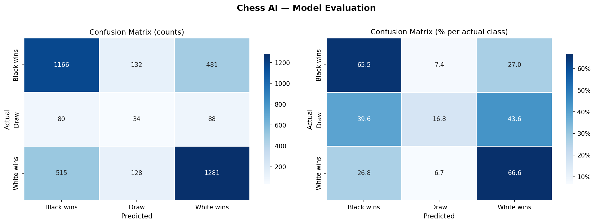
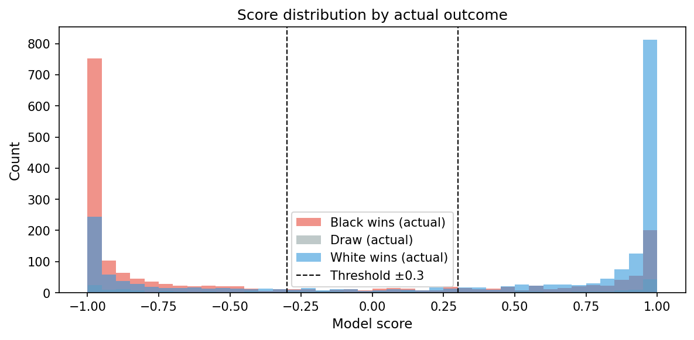

# Chess AI — Neural Network + Alpha-Beta Search
 
A chess engine that combines a **convolutional neural network** position evaluator with **alpha-beta minimax search** — conceptually similar to how AlphaZero works, built from scratch in Python.
 
Trained on 20,000 real games from the [Kaggle Lichess dataset](https://www.kaggle.com/datasets/datasnaek/chess), achieving **63.5% overall accuracy** and F1 scores of 0.66–0.68 on decisive outcomes.
 
---
 
## Results
 
| Metric | Value |
|--------|-------|
| Overall accuracy | 63.5% |
| Black wins F1 | 0.659 |
| White wins F1 | 0.679 |
| Draw F1 | 0.137 |
| Training positions | 38,088 |
| Model parameters | ~180,000 |
 
### Confusion matrix
 

 
### Score distribution
 

 
The model correctly identifies decisive outcomes (White/Black wins) ~66% of the time. Draws are intentionally difficult to predict from a single board snapshot — the model outputs near-extreme scores for most positions, consistent with training on game result labels rather than engine evaluations.
 
---
 
## How it works
 
```
Board state (8×8)
      │
      ▼
Board encoder          →  (12, 8, 8) tensor
      │                   12 planes, one per piece type per colour
      ▼
CNN Evaluator          →  score in [-1, 1]
  3 × residual blocks      +1 = White winning
  Global avg pool          -1 = Black winning
      │
      ▼
Alpha-Beta Search      →  best move
  Minimax + pruning
  Depth 3-5 plies
```
 
The neural network is trained via **supervised learning** on the Kaggle Lichess dataset — it learns to predict game outcomes from positions, developing an implicit understanding of piece activity, king safety, and pawn structure.
 
---
 
## Project structure
 
```
chess-ai/
├── board_encoder.py   # Converts chess.Board → (12,8,8) tensor
├── model.py           # CNN architecture (ChessEvaluator)
├── train.py           # Training pipeline (CSV/PGN → model weights)
├── search.py          # Alpha-beta engine
├── play.py            # Terminal UI to play against the AI
├── evaluate.py        # Confusion matrix + classification report
├── requirements.txt
└── models/            # Saved model weights (created after training)
```
 
---
 
## Quickstart
 
### 1. Install dependencies
 
```bash
pip install -r requirements.txt
```
 
### 2. Play immediately (no training needed)
 
The engine works right away using a material-count heuristic:
 
```bash
python play.py --depth 3
```
 
### 3. Train the neural network
 
Download the [Kaggle Lichess dataset](https://www.kaggle.com/datasets/datasnaek/chess) and place `games.csv` in the `data/` folder, then:
 
```bash
python train.py --csv data/games.csv --epochs 20 --max-games 5000
```
 
Training logs validation loss each epoch and saves the best checkpoint to `models/chess_eval.pt`.
 
You can also train on a PGN file:
 
```bash
python train.py --pgn data/games.pgn --epochs 20 --max-games 5000
```
 
### 4. Play against the trained model
 
```bash
python play.py --model models/chess_eval.pt --depth 3
```
 
Play as Black:
 
```bash
python play.py --model models/chess_eval.pt --depth 3 --color black
```
 
### 5. Evaluate the model
 
```bash
python evaluate.py --model models/chess_eval.pt --csv data/games.csv
```
 
Generates `confusion_matrix.png` and `score_distribution.png` and prints a full classification report.
 
---
 
## Controls (in-game)
 
| Input | Action |
|-------|--------|
| `e4`, `Nf3`, `O-O` | Make a move (SAN notation) |
| `undo` | Take back your last move |
| `board` | Reprint the board |
| `quit` | Exit |
 
---
 
## Key concepts demonstrated
 
| Concept | Where |
|---------|-------|
| **Board representation** | `board_encoder.py` — 12-plane bitboard tensor |
| **Residual CNNs** | `model.py` — ResNet-style architecture |
| **Supervised learning** | `train.py` — result-based position labelling |
| **Alpha-beta pruning** | `search.py` — classic AI search algorithm |
| **Model evaluation** | `evaluate.py` — confusion matrix, F1, classification report |
| **CLI application design** | `play.py` — ANSI terminal chess board |
 
---
 
## Configuration
 
| Flag | Default | Description |
|------|---------|-------------|
| `--depth` | 3 | Search depth in plies. 3 = fast, 5 = strong |
| `--epochs` | 20 | Training epochs |
| `--max-games` | 5000 | Games to train on |
| `--res-blocks` | 3 | Residual blocks in model |
| `--batch-size` | 256 | Training batch size |
 
---
 
## Extending the project
 
- **Self-play training** — generate games between two copies of the engine and label with game result
- **Policy head** — add a second output head predicting move probabilities (full AlphaZero style)
- **Stockfish labels** — replace result-based labels with centipawn evaluations for better draw detection
- **Opening book** — load ECO openings and skip search in the first 10 moves
- **UCI protocol** — implement the Universal Chess Interface so the engine works in GUIs like Arena or Lichess's board editor
- **Web UI** — expose the engine via FastAPI and build a browser board with `chess.js`
 
---
